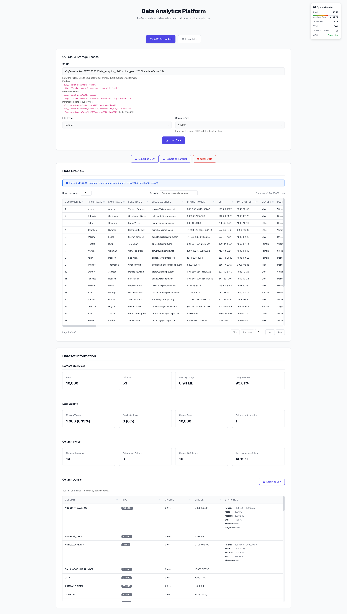

# Data Visualizer

A simple data visualization tool for CSV and Parquet files with S3 support.

## Features

- **S3 Integration**: Read data directly from AWS S3 buckets
- **Partitioned Data**: Support for Hive-style partitioned datasets (`year=2025/month=06/day=29/`)
- **URL Encoding**: Handles URL-encoded S3 paths (`year%3D2025/month%3D06/day%3D29/`)
- **Multiple Formats**: CSV and Parquet file support
- **File Upload**: Local file upload with drag & drop
- **Data Preview**: Basic statistics and data overview
- **Sample Processing**: Configurable row limits for large datasets
- **System Monitor**: Real-time CPU, RAM usage, and AWS connectivity status

## Installation

1. **Install dependencies**
   ```bash
   pip install -r requirements.txt
   ```

2. **Start the application**
   ```bash
   python run.py
   ```

3. **Open in browser**
   ```
   http://localhost:5000
   ```

## Screenshot



## Usage

### S3 Data

Enter an S3 URL in any of these formats:

**Folders:**
- `s3://bucket-name/folder/path/`
- `https://bucket-name.s3.amazonaws.com/folder/path/`

**Individual Files:**
- `s3://bucket-name/path/file.csv`
- `https://bucket-name.s3.us-east-1.amazonaws.com/path/file.csv`

**Partitioned Data:**
- `s3://bucket-name/data/year=2025/month=06/day=29/`
- `s3://bucket-name/data/year=2025/month=06/day=29/file.parquet`
- `s3://bucket/data/year%3D2025/month%3D06/day%3D29/` (URL-encoded)

### Local Files

Drag and drop CSV or Parquet files, or click "Choose File" to browse.

## Requirements

- Python 3.8+
- AWS credentials (for S3 access)
- Modern web browser

## Dependencies

- Flask - Web framework
- Dask - Data processing
- pandas - Data analysis
- boto3 & s3fs - AWS S3 access
- pyarrow - Parquet support

## File Structure

```
data-visualizer/
├── app.py              # Main application
├── run.py              # Startup script
├── requirements.txt    # Dependencies
├── templates/
│   └── index.html     # Web interface
└── uploads/           # Temporary storage
```